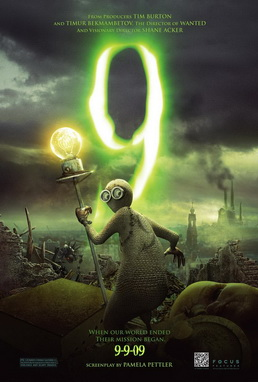

# Cinema

- [x] John Wick 4
  - description: John Wick Series
  - review: like shit
  - year: 2023
- [x] Dungeons & Dragons: Honor Among Thieves (2023)
  - review: D&D world is really interesting
  - year: 2023
- [x] Guadian of the Galaxy Vol.3
  - description: pretty good in comparison to other mavel movies
  - year: 2023
- [x] City of Ember
  - description: Post Apocalypse
  - tuổi thơ về một thành phố ngầm, sau đó có 2 đứa trẻ chui lên được khỏi mặt đất và wtf
  - 2 chúng nó sau này rồi sao 🙂
- [x] Enigma (2023)
  - description: Thai movie with beautifull girl
  - year: 2023
  - được mỗi nhân vật chính xinh, còn lại thì nội dung cũng bình thường
- [x] Moon Fall (2023)
  - description: Apocalypse
  - year: 2023
- [x] Reminiscence
  - description: Hugh Jackman
  - review: ok
- [x] Gulmo De Toro - Pinocchio (2022)
  - bất tử để làm gì
  - xem hay, nhẹ nhàng, mà đúng chất gulmo de toro
- [x] Nope (2022)
  - description: Jodan Pele
  - review: ok
  - Người ngoài hành tinh và ai mới là nhân vật chính
- [x] SUPER MARIO BROS - The Movie
  - year: 2023
  - done
- [x] ROBOTS (2005)
- [x] The Northman (2022)
  - description: Anya Taylor-Joy
  - cũng hay
- [x] Bullet Train
  - xem giải trí vl, nói chung là ổn
- [x] Constantine
- [x] Prey (2022)
  - Predator, alien, …
- [x] Hell Raiser 2022
  - review: interesting, ổn áp
- [x] No Country for Old Men
  - đỉnh thực sự về tâm lý tội phạm lẫn nỗi sợ một thứ mà mình đéo biết
- [x] Titanic
- [x] Lala land
- [x] Come True (2019)
  - review: nói chung là hay
- [x] Detension (2019)
- [x] Detension (2020)
- [ ] Sinister
- [x] 21 Jump Street (2012)
- [x] Flushed Away
  - description: Hành trình của một con chuột cảnh bị rơi xuống cống
- [x] Minuscule - Valley of the Lost Ants (2013)
- [x] Minuscule - Mandibles from Far Away (2019)
- [x] Bạch Xà - Duyên Khởi
- [x] Bạch Xà 2 - Thanh Xà Kiếp Khởi
- [x] Free Guy
- [x] Back to Future
  - **TODO** có cả một sequence nên xem hết nhá
- [x] Blaze Runner 2049
- [x] Sausage Party
  - bệnh hoạn ✌️
- [x] The Mummy (1999)
- [x] Treasure Planet
  - description: Cuộc phiêu lưu từng là giấc mơ thời bé của một đứa trẻ
  - review: Một thời tuổi thơ
- [x] Wall E
  - Legendary
- [x] Lucy
- [ ] Minority Report (2002)
- [ ] Altered Carbon - Resleeved (2020)
- [x] 9 (2009)
  - 
  - một bộ phim về hậu tận thế xem khá là tò mò và lạ
- [x] Abraham Lincoln - Vampire Hunter (2012)
  - review: tổng thống đi săn zombie
- [x] Army of the Dead (2021)
- [x] Astro Boy (2003)
- [x] Atlantis
- [x] Biệt Đội Bất Hảo
- [x] Chicken Run (2000)
- [x] click (2006)
- [x] Coraline
  - description: Laika Laika
- [x] Deep Rising (1998)
- [x] Despicable Me
- [x] Don't Breath
- [x] Edward Scissorhands (1990)
- [x] Epic (2013)
- [ ] G - Force
- [x] Get Out
- [x] Ghét Thì Yêu Thôi (2018)
- [x] Godzilla (2014)
- [x] Godzilla vs. Kong
- [x] Godzilla x Kong: The new empire
- [x] Harry Potter
  - Part 1-7
- [x] Hitman 47
- [x] Interstella (2014)
- [x] Iron Giant (1999)
- [x] isle of dog (2018)
- [x] Jack The Giant Slayer (2013)
- [x] King Kong
- [x] Kingsman
- [x] Monster. Inc
- [x] Mortal Kombat (2021)
- [x] New Gods - Nezha Reborn (2021)
- [x] On Ward (2020)
- [x] Pixcels (2015)
- [x] Pirate of Caribean
- [x] Plus One (2019)
- [x] Pride And Prejudice And Zombies (2016)
- [x] Zathura: A Space Adventure
  - hai anh em chơi trò chơi thế đéo nào bay mẹ ra ngoài vũ trụ
  - hay phết, phim tuổi thơ
  - [Boardgame này nhớ đọc kĩ hướng dẫn sử dụng trước khi dùng | Recap xàm: Zathura: : A Space Adventure](https://www.youtube.com/watch?v=XAE6hwrH-yk)
- [x] Priest (2011)
- [x] Rango
- [x] Reign of Fire (2002)
- [x] Silent Hill
  - description: Huyển thoại một thời
  - review: Đỉnh của chóp, mỗi tội phần 2 hơi phèn
- [x] Source Code
- [ ] Space Pirate Captain Harlock (2013)
- [x] Sweet Home (2020)
- [x] The Addams
- [x] The Day After Tomorrow (2004)
- [x] The Last Witch Hunter
- [ ] The Man With The Iron Fists (2012)
- [x] The Matrix
- [x] The Matrix: Reload
- [x] The Matrix Resurrections (2021)
- [x] The Mist (2007)
- [x] Charlie and the Chocolate Factory
  - year: 2005
  - links: https://en.wikipedia.org/wiki/Charlie_and_the_Chocolate_Factory_(film)
- [x] Wonka
  - Spinoff
  - year: 2023
- [x] The Suicide Squad (2021)
- [x] The Tomorrow War (2021)
- [x] The Worlds End (2013)
- [x] Tomorrowland (2015)
- [ ] Kingdom of the Planet of the Apes (2024)
- [x] Tron Legacy
- [x] Underwater (2020)
- [x] Upside Down
- [x] Valerian and The City of a Thousand Planets
- [ ] Resident Evil: Welcome to Racoon city (2021)
- [ ] Dawn of the dead (2004) - Zach Snyder
- [x] The Kingsman (2022)
- [ ] Spiderwick's Chronicles
- [ ] The Wheel of Time (2023)
  - links: [https://www.youtube.com/watch?v=8bbG_Mxhoo8](https://www.youtube.com/watch?v=8bbG_Mxhoo8)
- [x] The Creator (2023)
- [x] M3gan (2023)
- [ ] Phong Than Tam Bo Khuc
  - links: [https://www.youtube.com/watch?v=3WRM061SDgo](https://www.youtube.com/watch?v=3WRM061SDgo)
  - description: Girl xinh
- [ ] [Noah (2014)](./Cinema/Noah_2014.md)
- [ ] [Pulp Fiction (1994)](./Cinema/Pulp_Fiction_1994.md)
- [ ] external sunshine of the spotless mind (2004)
- [ ] [The Great Gatsby](./Cinema/The_Great_Gatsby.md)
- [ ] Paranoidman
- [ ] [Raw](./Cinema/Raw.md)
- [ ] [Bone and all](./Cinema/Bone_and_All.md)
- [x] ***Meet the Robinsons***
- [ ] Terrifier 2 (2022)
- [ ] Terrifier 3 (2024)
- [ ] Oz the great and powerfull
- [ ] It follow
- [ ] [Taxi Driver](./Cinema/Taxi_Driver.md)
- [ ] [Memories of Geisha](./Cinema/Memories_of_Geisha.md)
- [x] Godzilla Minus One
- [ ] Silo (2023)
- [ ] Trick or Treat (2009)
- [ ] [Total Recall](./Cinema/Total_Recall.md)
  - sci fi
- [ ] West World
  - sci fi
- [ ] Foundation 2023
- [ ] Red Sparrow (3x)
- [ ] See (2021)
- [ ] [Guillermo del Toro's Cabinet of Curiosities](./Cinema/Guillermo_del_Toro_Cabinet_of_Curiosities.md)
- [ ] [Hardcore Henry (2015)](./Cinema/Hardcore_Henry_2015.md)
- [ ] [MALÈNA: Con dao HAI LƯỠI mang tên SẮC ĐẸP](./Cinema/MALENA.md)
- [ ] [1899](./Cinema/1899.md)
- [ ] [Dogtooth](./Cinema/Dogtooth.md)
- [ ] [WHERE THE CRAWDADS SING](./Cinema/WHERE_THE_CRAWDADS_SING.md)
- [ ] [Upgrade](./Upgrade.md)
- [ ] [Igra na vyzhivanie (TV Series) (2020)](./Igra_na_vyzhivanie_(TV_Series)_(2020).md)
- [ ] [Mira (2023)](./Mira_(2023).md)
- [ ] [The Mandalorian (STAR WAR)](./The_Mandalorian_(STAR_WAR).md)
- [x] [A real young girl](./A_real_young_girl.md)
- [x] [Crime of The Furture (2022)](./Crime_of_The_Furture_(2022).md)
- [ ] [Three thoundsand years of longing (2022)](./Three_thoundsand_years_of_longing_(2022).md)
- [ ] [Existenz 90s](./Existenz_90s.md)
- [ ] [Smile 2022](./Smile_2022.md)
- [ ] Thập diện mai phục
- [ ] [The House: Netflix](./The_House_Netflix.md)
- [ ] [Air plane 1980](./Air_plane_1980.md)
- [ ] [The interview (2014)](./The_interview_(2014).md)
- [ ] [Tuker and dale vs devil](./Tuker_and_dale_vs_devil.md)
- [ ] [Nobody](./Nobody.md)
- [ ] [The Queen's Classroom (2005-2006)](./The_Queen's_Classroom_(2005-2006).md)
- [ ] [Hannibal](./Hannibal.md)
- [ ] Ghostbusters: After Life
- [ ] Ghostbusters: Frozen Empire (2024)
- [ ] Saw
- [ ] Smile
- [ ] Smile 2
- [ ] Smile 3
- [ ] Dredd
- [ ] KLAUS
- [ ] [CON NHÀ GIÀU "VƯỢT SƯỚNG" như thế nào? - GIẢI THÍCH KLAUS](https://www.youtube.com/watch?v=LCab1ueAsU4)
- [ ] [Se7en (Seven)](./Se7en_(Seven).md)
- [ ] American Psycho (2000)
- [ ] [The Empty Man](./The_Empty_Man.md)
- [ ] [The Magligent (2021)](./The_Magligent_(2021).md)
- [ ] [I saw the devil (2010)](./I_saw_the_devil_(2010).md)
- [ ] [The silent of the lambs](./The_silent_of_the_lambs.md)
- [ ] [Suicide Club](./Suicide_Club.md)
- [ ] [Fight Club - Stephen King](./Fight_Club_-_Stephen_King.md)
- [ ] Drive (2011)
- [ ] Men (2022)
- [ ] Sói già phố wall
- [ ] Stand by me - Stephen King
- [ ] 2001 a space odessy
- [ ] Top Gun Maverick
- [ ] Light Year
- [ ] The Tag-Along (2015) kinh vãi đái
- [ ] Starship Trooper
- [ ] Người phán xử
- [ ] Perfume: The story of a murder
- [ ] The shinning + Doctor Sleep
- [ ] Thiên linh cái
- [ ] [Fear and Hunger](./Fear_and_Hunger.md)
- [ ] [**Shawshank Redemption**](./Shawshank_Redemption.md)
- [ ] [Tokyo Vice](./Tokyo_Vice.md)
- [ ] [The Prestige (2006)](./The_Prestige_(2006).md)
- [ ] [ODDITY](./ODDITY.md)
- [ ] [LATE NIGHT WITH THE DEVIL](./LATE_NIGHT_WITH_THE_DEVIL.md)
- [ ] [**Corpes Bride**](./Corpes_Bride.md)
- [ ] [Cukoo](./Cukoo.md)
- [x] [UP (Vút bay)](./UP_(Vút_bay).md)
- [ ] [**The Substance (2024)**](https://www.imdb.com/title/tt17526714/)
- [x] [Quật mộ trùng ma](./Quật_mộ_trùng_ma.md)
- [ ] [Infinity Pool (2023)](./Infinity_Pool_(2023).md)
- [ ] [The breakfast club (1985)](./The_breakfast_club_(1985).md)
- [x] [Quốc sản 007](./Quốc_sản_007.md)
- [x] [A.I. Artificial Intelligence](./A_I_Artificial_Intelligence.md)
- [ ] [**Small Soldiers (1998)**](./Small_Soldiers_(1998).md)
- [ ] [Sicario 1+2 (Tội phạm mexico)](./Sicario_1+2_(Tội_phạm_mexico).md)
- [ ] [**TIME STILL TURNS THE PAGES (áp lực học đường)**](./TIME_STILL_TURNS_THE_PAGES_(áp_lực_học_đường).md)
- [x] [Secret Level 2024](./Secret_Level_2024.md)
- [x] [Game of Thrones (A song of ice and fire)](./Game_of_Thrones_(A_song_of_ice_and_fire).md)
- [ ] [LEGO NINJAGO](./LEGO_NINJAGO.md)
- [ ] [The walking dead](./The_walking_dead.md)
- [ ] [Love, Death + Robots](./Love,_Death_+_Robots.md)
- [x] [Monarch: Legacy of Monsters (2023)](./Monarch_Legacy_of_Monsters_(2023).md)
- [ ] [***The Lord of the Rings: The Rings of Power***](./The_Lord_of_the_Rings_The_Rings_of_Power.md)
- [ ] [Chenobyl (2019)](./Chenobyl_(2019).md)
- [ ] [Twisted Metal TV Series 2023](./Twisted_Metal_TV_Series_2023.md)
- [x] [Arcane - RiotGames](./Arcane_-_RiotGames.md)
- [ ] Record of Lodoss War
- [ ] Blade the Vampire Hunter (1981)
- [ ] [Gintama](./Gintama.md)
- [ ] Akame Ga Kill
- [ ] Zom 100: Bucket List of the Dead
- [ ] Prison School
- [ ] Windfall of the Dead
- [ ] TENGOKU DAIMAKYOU
- [x] [Cowboy Bebop](./Cowboy_Bebop.md)
- [ ] Lupin
- [x] Perfect blue
- [x] [Roujin Z (1991)](./Roujin_Z_1991.md)
- [ ] Gyo Junji Ito
- [ ] Drifter
- [x] [Record of Ragnarok](./Record_of_Ragnarok.md)
- [x] [**JoJo's Bizarre Adventure**](./JoJo_Bizarre_Adventure.md)
- [ ] JIGOKURAKU - Địa ngục cực lạc (Anime)
- [ ] No Game, No Life
- [ ] [Vinland Saga](./Vinland_Saga.md)
- [ ] Drifters
- [ ] Ghost In The Shell: Innocence
- [x] [Chainsaw Man](./Chainsaw_Man.md)
- [ ] highlander the search for vengeance (2007)
- [ ] hunter x hunter
- [ ] Evangelion
- [ ] Rebuild Evangelion
- [ ] charlotte
- [ ] 86 series
- [ ] code gears
- [ ] full metal panic
- [ ] eureka seven
- [ ] tengen toppa gurren lagann
- [x] [Made in Abyss](./Made_in_Abyss.md)
- [ ] re: zero
- [ ] blood c (2011)
- [ ] Hellsing (anime)
- [ ] Corpse Party
- [ ] Assassination Classroom (2015)
- [ ] Elfen lied (2004)
- [ ] Ajin (2016)
- [ ] Noblesse: 2 OVA
- [ ] zet man
- [ ] kabaneri of the iron fortress
- [ ] dance in vampire bund
- [ ] My Dress Up Darling
- [x] Demon Slayer (SS1)
- [x] Demon Slayer (SS2)
- [x] Demon Slayer - Mugen Train
- [x] [Parasite (Anime)](./Parasite_Anime.md)
- [x] Jin-Roh: The Wolf Brigade
- [x] Red Line (2005)
- [x] [Berserk](./Berserk.md)
- [x] Ninja Scroll (1993)
- [x] Vampire Hunter D: Bloodlust
- [ ] [Vagabond](./Vagabond.md)
- [ ] [Bibliomania](./Bibliomania.md)
- [ ] [DORORO](./DORORO.md)
- [x] [Death Parade](./Death_Parade.md)
- [x] [Sword Art Online](./Sword_Art_Online.md)
- [x] Darling in the Franxx
- [x] [Akira (1988)](./Akira_1988.md)
- [x] [Hyouka](./Hyouka.md)
- [x] One-Punch Man
- [x] [Attack on Titan](./Attack_on_Titan.md)
- [x] Tokyo Ghoul
- [ ] [Grantz O](./Grantz_O.md)
- [x] Jujustu Kaisen (SS1)
- [x] Tokyo Revenger (SS1)
- [x] [Paprika](./Paprika.md)
- [ ] [Trigun Stamdepe](./Trigun_Stamdepe.md)
- [ ] [Suisei no Gargantia](./Suisei_no_Gargantia.md)
- [x] [Cyberpunk 2077: Edge Runner](./Cyberpunk_2077_Edge_Runner.md)
- [ ] [D-1 Devastator!](./D-1_Devastator!.md)
- [ ] Metal Skin Panic MADOX-01
- [x] Angel's Egg (1985)
- [ ] [The Memories (1995)](./The_Memories_(1995).md)
- [ ] [Castlevania](./Castlevania.md)
- [ ] [**Terminator Zero (2024)**](./Terminator_Zero_(2024).md)
- [ ] Pluto
- [ ] [Blue eye samurai](./Blue_eye_samurai.md)
- [x] [Kite 1998](./Kite_1998.md)
- [ ] Hell’s Paradise.
- [x] Once Upon a Time in Hollywood
- [x] [Evil Dead Series](./Evil_Dead_Series.md)
- [x] [FLOW (lạc trôi) - 2024](./Flow_2024.md)
- [x] [Bram Stoker's Dracula](./Bram_Stocker_Dracula_1992.md)
- [x] [Water World 1995](./Water_World_1995.md)
- [x] [Midsomar 2019](./Midsomar_2019.md)
- [x] [Parasite Dolls (2003)](./Parasite_Dolls_2003.md)
- [x] [Frankenstein (2025)](./Frankenstein_2025.md)
- [x] [Kung Fu Hustle (2004)](./Kung_Fu_Hustle_2004.md)
- [x] [Blink Twice](./Blink_Twice.md)
- [x] [Together 2025](./Together_2025.md)
- [x] Re:born 2016 https://www.youtube.com/shorts/3Z3pb2VJXao
- [x] Immortals (2011)
  - nah
- [x] [Sleeping Beauty (2011)](./Sleeping_Beauty_2011.md)
- [x] [The Neon Demon (2016)](./The_Neon_Demon_2016.md)
- [x] [The LEGO Batman Movie (2017)](./The_LEGO_Batman_Movie_2017.md)
- [x] [IT: Welcome to Derry Chapter 1](./IT_Welcome_to_Derry_Chapter_1.md)
- [x] The Truman Show (1998)
  - you'll never be the same person

# [Studio Ghibli](./Studio_Ghibli.md)

- [x] [Spirited Away](./Spirited_Away.md)
- [x] The Wind Rises
- [x] Howl Moving Castle
- [x] From Up On Poppy Hill
- [x] The Secret World of Arrietty
- [x] Princess Mononoke
- [x] Nausicaa - Princess of the Valley
- [x] Laputa Flying Castle
- [x] [The Boy and the Heron](./The_Boy_and_the_Heron.md)

# [Gundam Universe](./Gundam_Universe.md)

- [ ] Gundam Seed
- [x] [MS GUNDAM: IRON-BLOODED ORPHANS](./MS_GUNDAM_IRON-BLOODED_ORPHANS.md)
- [ ] [**Gundam: Requiem for Vengeance (2024)**](./Gundam_Requiem_for_Vengeance_2024.md)

# [X trilogy](./X_trilogy.md)

- [x] X (2022)
- [x] [X: Perl (2022)](./X_Pearl.md)
- [x] X: Maxinne (2024)

# [Sonic the Hedgehog's series](./Cinema/Sonic_the_Hedgehog_Series.md)

# Avatars

- [x] Avatar (2008)
- [x] Avatar: The Way of Water (2022)
- [x] Avatar: Fire and Ash (2025)

# [Dune: Trilogy](./Cinema/Dune_Trilogy.md)

# A Quiet Place Series

- [x] A Quiet Place
- [x] A Quiet Place Part II (2020)
- [x] A Quiet Place: Day One (2024)
  - alien queen, but nothing special

# [Alien series](./Alien_series.md)

# [Toy Story Series](./Cinema/Toy_Story_Series.md)

- [x]  1
- [x]  2
- [x]  3
- [x]  4
- [ ]  Light Year

# [Resident Evil](./Cinema/Resident_Evil.md)

- review: Milla Jocovick [https://en.m.wikipedia.org/wiki/Milla_Jovovich](https://en.m.wikipedia.org/wiki/Milla_Jovovich) she is so beautiful.
- [x]  Resident Evil (2002)
- [x]  Resident Evil - Afterlife (2010)
- [x]  Resident Evil - Apocalypse (2004)
- [x]  Resident Evil - Extinction (2007)
- [x]  Resident Evil - Retribution (2012)
- [x]  Resident Evil - The Final Chapter (2016)

# Transformers Series

- [x]  Transformer - The Movie (1986)
- [x]  Transformers (Michael Bay)
- [x]  Transformers 2 (Michael Bay)
- [x]  Transformers 3 (Michael Bay)
- [x]  Transformers 4 (Michael Bay)
- [x]  Transformers 5 (Michael Bay)
- [x]  Transformers: Bumblebee
- [x]  Transformers: Rise of the beast
- [x]  Transformers: One (2024)

# [Mad max saga](./Cinema/Mad_max_saga.md)

- review: what a day! what a lovely day!
- [x] Mad Max - Fury Road (2015)
- [x] Furiosa: A Mad Max Saga (2024)
