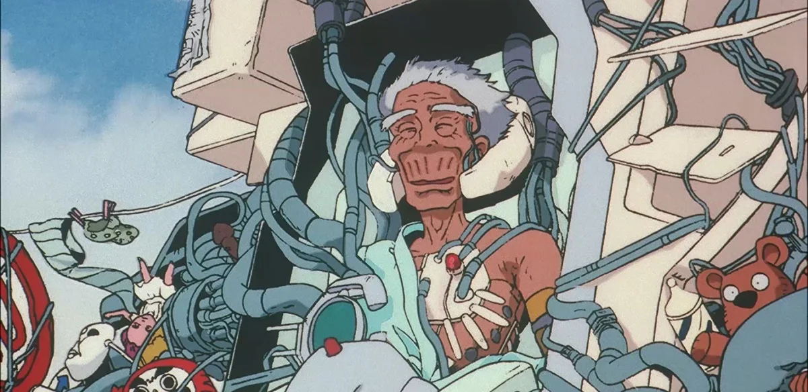
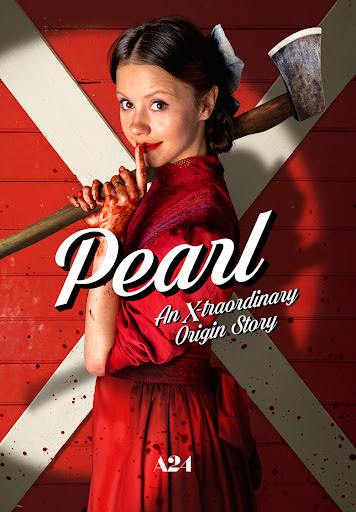

# Cinema

- [x] John Wick 4
  - description: John Wick Series
  - review: like shit
  - year: 2023
- [x] Dungeons & Dragons: Honor Among Thieves (2023)
  - review: D&D world is really interesting
  - year: 2023
- [x] Guadian of the Galaxy Vol.3
  - description: pretty good in comparison to other mavel movies
  - year: 2023
- [x] City of Ember
  - description: Post Apocalypse
  - tuổi thơ về một thành phố ngầm, sau đó có 2 đứa trẻ chui lên được khỏi mặt đất và wtf
  - 2 chúng nó sau này rồi sao 🙂
- [x] Enigma (2023)
  - description: Thai movie with beautifull girl
  - year: 2023
  - được mỗi nhân vật chính xinh, còn lại thì nội dung cũng bình thường
- [x] Moon Fall (2023)
  - description: Apocalypse
  - year: 2023
- [x] Reminiscence
  - description: Hugh Jackman
  - review: ok
- [x] Gulmo De Toro - Pinocchio (2022)
  - bất tử để làm gì
  - xem hay, nhẹ nhàng, mà đúng chất gulmo de toro
- [x] Nope (2022)
  - description: Jodan Pele
  - review: ok
  - Người ngoài hành tinh và ai mới là nhân vật chính
- [x] SUPER MARIO BROS - The Movie
  - year: 2023
  - done
- [x] ROBOTS (2005)
- [x] The Northman (2022)
  - description: Anya Taylor-Joy
  - cũng hay
- [x] Bullet Train
  - xem giải trí vl, nói chung là ổn
- [x] Constantine
- [x] Prey (2022)
  - Predator, alien, …
- [x] Hell Raiser 2022
  - review: interesting, ổn áp
- [x] No Country for Old Men
  - đỉnh thực sự về tâm lý tội phạm lẫn nỗi sợ một thứ mà mình đéo biết
- [x] Titanic
- [x] Lala land
- [x] Come True (2019)
  - review: nói chung là hay
- [x] Detension (2019)
- [x] Detension (2020)
- [ ] Sinister
- [x] 21 Jump Street (2012)
- [x] Flushed Away
  - description: Hành trình của một con chuột cảnh bị rơi xuống cống
- [x] Minuscule - Valley of the Lost Ants (2013)
- [x] Minuscule - Mandibles from Far Away (2019)
- [x] Bạch Xà - Duyên Khởi
- [x] Bạch Xà 2 - Thanh Xà Kiếp Khởi
- [x] Free Guy
- [x] Back to Future
  - **TODO** có cả một sequence nên xem hết nhá
- [x] Blaze Runner 2049
- [x] Sausage Party
  - bệnh hoạn ✌️
- [x] The Mummy (1999)
- [x] Treasure Planet
  - description: Cuộc phiêu lưu từng là giấc mơ thời bé của một đứa trẻ
  - review: Một thời tuổi thơ
- [x] Wall E
  - Legendary
- [x] Lucy
- [ ] Minority Report (2002)
- [ ] Altered Carbon - Resleeved (2020)
- [x] 9 (2009)
  - 
  - một bộ phim về hậu tận thế xem khá là tò mò và lạ
- [x] Abraham Lincoln - Vampire Hunter (2012)
  - review: tổng thống đi săn zombie
- [x] Army of the Dead (2021)
- [x] Astro Boy (2003)
- [x] Atlantis
- [x] Biệt Đội Bất Hảo
- [x] Chicken Run (2000)
- [x] click (2006)
- [x] Coraline
  - description: Laika Laika
- [x] Deep Rising (1998)
- [x] Despicable Me
- [x] Don't Breath
- [x] Edward Scissorhands (1990)
- [x] Epic (2013)
- [ ] G - Force
- [x] Get Out
- [x] Ghét Thì Yêu Thôi (2018)
- [x] Godzilla (2014)
- [x] Godzilla vs. Kong
- [x] Godzilla x Kong: The new empire
- [x] Harry Potter
  - Part 1-7
- [x] Hitman 47
- [x] Interstella (2014)
- [x] Iron Giant (1999)
- [x] isle of dog (2018)
- [x] Jack The Giant Slayer (2013)
- [x] King Kong
- [x] Kingsman
- [x] Monster. Inc
- [x] Mortal Kombat (2021)
- [x] New Gods - Nezha Reborn (2021)
- [x] On Ward (2020)
- [x] Pixcels (2015)
- [x] Pirate of Caribean
- [x] Plus One (2019)
- [x] Pride And Prejudice And Zombies (2016)
- [x] Zathura: A Space Adventure
  - hai anh em chơi trò chơi thế đéo nào bay mẹ ra ngoài vũ trụ
  - hay phết, phim tuổi thơ
  - [Boardgame này nhớ đọc kĩ hướng dẫn sử dụng trước khi dùng | Recap xàm: Zathura: : A Space Adventure](https://www.youtube.com/watch?v=XAE6hwrH-yk)
- [x] Priest (2011)
- [x] Rango
- [x] Reign of Fire (2002)
- [x] Silent Hill
  - description: Huyển thoại một thời
  - review: Đỉnh của chóp, mỗi tội phần 2 hơi phèn
- [x] Source Code
- [ ] Space Pirate Captain Harlock (2013)
- [x] Sweet Home (2020)
- [x] The Addams
- [x] The Day After Tomorrow (2004)
- [x] The Last Witch Hunter
- [ ] The Man With The Iron Fists (2012)
- [x] The Matrix
- [x] The Matrix: Reload
- [x] The Matrix Resurrections (2021)
- [x] The Mist (2007)
- [x] Charlie and the Chocolate Factory
  - year: 2005
  - links: https://en.wikipedia.org/wiki/Charlie_and_the_Chocolate_Factory_(film)
- [x] Wonka
  - Spinoff
  - year: 2023
- [x] The Suicide Squad (2021)
- [x] The Tomorrow War (2021)
- [x] The Worlds End (2013)
- [x] Tomorrowland (2015)
- [ ] Kingdom of the Planet of the Apes (2024)
- [x] Tron Legacy
- [x] Underwater (2020)
- [x] Upside Down
- [x] Valerian and The City of a Thousand Planets
- [ ] Resident Evil: Welcome to Racoon city (2021)
- [ ] Dawn of the dead (2004) - Zach Snyder
- [x] The Kingsman (2022)
- [ ] Spiderwick's Chronicles
- [ ] The Wheel of Time (2023)
  - links: [https://www.youtube.com/watch?v=8bbG_Mxhoo8](https://www.youtube.com/watch?v=8bbG_Mxhoo8)
- [x] The Creator (2023)
- [x] M3gan (2023)
- [ ] Phong Than Tam Bo Khuc
  - links: [https://www.youtube.com/watch?v=3WRM061SDgo](https://www.youtube.com/watch?v=3WRM061SDgo)
  - description: Girl xinh
- [ ] Noah (2014)
  - description: Appocalypse
  - year: 2014
- [ ] Pulp Fiction (1994)
  - year: 1994
- [ ] external sunshine of the spotless mind (2004)
- [ ] The Great Gatsby
  - links:
    - https://youtu.be/82Ivwtv9RIU?si=Ls2c249dMYvjMqFH
  - description: Nhà giàu, tình tan, đời tàn
- [ ] Paranoidman
- [ ] Raw
  - year: 2016
  - description: Canibal
  - links:
    - https://youtu.be/76ZnRzo5ruM?si=EbTUi3ioDCHd8WGx
- [ ] Bone and all
  - description: Canibal
  - year: 2022
- [x] ***Meet the Robinsons***
  - [https://en.wikipedia.org/wiki/Meet_the_Robinsons](https://en.wikipedia.org/wiki/Meet_the_Robinsons)
  - du hành thời gian
  - tuổi thơ
- [ ] Terrifier 2 (2022)
- [ ] Terrifier 3 (2024)
- [ ] Oz the great and powerfull
- [ ] It follow
- [ ] Taxi Driver
  - description: nặng đô, Martin Scocessi.
- [ ] Memories of Geisha
  - links:
    - https://youtu.be/3qGymLVjeEM?si=ZpkgT_wP9EW3-QTX
- [x] Godzilla Minus One
- [ ] Silo (2023)
- [ ] Trick or Treat (2009)
- [ ] Total Recall
  - description: Em đang nơi nào
- [ ] West World
  - sci fi
- [ ] Foundation 2023
- [ ] Red Sparrow (3x)
- [ ] See (2021)
- [ ] Guillermo del Toro's Cabinet of Curiosities
- [ ] Hardcore Henry (2015)
- [ ] MALÈNA: Con dao HAI LƯỠI mang tên SẮC ĐẸP
- [ ] 1899
- [ ] Dogtooth
- [ ] WHERE THE CRAWDADS SING
- [ ] Upgrade
- [ ] Igra na vyzhivanie (TV Series) (2020)
- [ ] Mira (2023)
- [ ] The Mandalorian (STAR WAR)
- [x] A real young girl
  - description: xxx
  - lú luôn, có cả quay cận cảnh
  - nội dung thì ko thẩm được từ những năm 1967
  - tiếng pháp hay tiếng đức gì đó
  - haizzz
- [x] Crime of The Furture (2022)
  - hmm khó hiểu
  - mà nữ chính đẹp và cho hết anh em xem
- [ ] Three thoundsand years of longing (2022)
- [ ] Existenz 90s
- [ ] Smile 2022
- [ ] Thập diện mai phục
- [ ] The House: Netflix
- [ ] Air plane 1980
- [ ] The interview (2014)
- [ ] Tuker and dale vs devil
- [ ] Nobody
- [ ] The Queen's Classroom (2005-2006)
- [ ] Hannibal
  - links:
    - [Phê Phim: TẤT TẦN TẬT VỀ HANNIBAL (Phần 1)](https://www.youtube.com/watch?v=MEfSq7wmgLs)
    - [Phê Phim: TẤT TẦN TẬT VỀ HANNIBAL (Phần cuối)](https://www.youtube.com/watch?v=3JvgdOL126Y)
- [ ] Ghostbusters: After Life
- [ ] Ghostbusters: Frozen Empire (2024)
- [ ] Saw
- [ ] Smile
- [ ] Smile 2
- [ ] Smile 3
- [ ] Dredd
- [ ] KLAUS
- [ ] [CON NHÀ GIÀU "VƯỢT SƯỚNG" như thế nào? - GIẢI THÍCH KLAUS](https://www.youtube.com/watch?v=LCab1ueAsU4)
- [ ] Se7en (Seven)
  - description: (kinh dị + trinh thám)
  - [https://youtu.be/mL9aHJDGDrM?si=COmlXEcbun5WEO8w](https://youtu.be/mL9aHJDGDrM?si=COmlXEcbun5WEO8w)
- [ ] American Psycho (2000)
- [ ] The Empty Man
- [ ] The Magligent (2021)
- [ ] I saw the devil (2010)
- [ ] The silent of the lambs
- [ ] Suicide Club
- [ ] Fight Club - Stephen King
- [ ] Drive (2011)
- [ ] Men (2022)
- [ ] Sói già phố wall
- [ ] Stand by me - Stephen King
- [ ] 2001 a space odessy
- [ ] Top Gun Maverick
- [ ] Light Year
- [ ] The Tag-Along (2015) kinh vãi đái
- [ ] Starship Trooper
- [ ] Người phán xử
- [ ] Perfume: The story of a murder
- [ ] The shinning + Doctor Sleep
- [ ] Thiên linh cái
- [ ] Fear and Hunger
  - description: Dark fantasy, Mature
- [ ] **Shawshank Redemption**
  - [https://www.youtube.com/watch?v=GDy4TkdcVdA](https://www.youtube.com/watch?v=GDy4TkdcVdA)
- [ ] Tokyo Vice
  - [https://www.youtube.com/watch?v=pBHmrbsH3P8](https://www.youtube.com/watch?v=pBHmrbsH3P8)
  - [https://www.youtube.com/watch?v=FZDFV_Duxsc](https://www.youtube.com/watch?v=FZDFV_Duxsc)
- [ ] The Prestige (2006)
  - nhân sinh quan
  - hugh jackman trong vai ảo thuật gia muốn làm ảo thuật teleport một cách nhanh và chuẩn nhất bằng cách nhân bản chính bản thân mình.
- [ ] ODDITY
  - kinh dị tâm lý
  - [https://www.youtube.com/watch?v=CbglKFHgWwg](https://www.youtube.com/watch?v=CbglKFHgWwg)
- [ ] LATE NIGHT WITH THE DEVIL
  - [https://www.youtube.com/watch?v=4qcxzFtG4W8](https://www.youtube.com/watch?v=4qcxzFtG4W8)
- [ ] **Corpes Bride**
  - [https://www.youtube.com/watch?v=GX75_OerkX0](https://www.youtube.com/watch?v=GX75_OerkX0)
  - [https://www.youtube.com/watch?v=dZwewx9U7pE](https://www.youtube.com/watch?v=dZwewx9U7pE)
- [ ] Cukoo
  - [https://youtu.be/d5kfpwWMjU4?si=w6rPQXafrKbLkRzs](https://youtu.be/d5kfpwWMjU4?si=w6rPQXafrKbLkRzs)
- [x] UP (Vút bay)
  - Pixar
  - [https://www.youtube.com/watch?v=ew-fVQyMZSo](https://www.youtube.com/watch?v=ew-fVQyMZSo)

- [ ] [**The Substance (2024)**](https://www.imdb.com/title/tt17526714/)
- [x] Quật mộ trùng ma
- [ ] Infinity Pool (2023)
  - [[Review Phim] Tương Lai Người Giàu Có Thể Tự Do Phạm Tội Mà Không Chịu Hậu Quả](https://youtu.be/qicYq-KBDoY?si=W9pQgIwJleROOYJn)
- [ ] The breakfast club (1985)
  - [https://en.wikipedia.org/wiki/The_Breakfast_Club](https://en.wikipedia.org/wiki/The_Breakfast_Club)
- [x] Quốc sản 007
- [x] A.I. Artificial Intelligence
  - [A.I. Artificial Intelligence](https://en.wikipedia.org/wiki/A.I._Artificial_Intelligence)
  - của đạo diễn Steven Spielberg
  - mình xem qua một đoạn short trên youtube thì có cảnh người máy trông khá là hấp dẫn và cầu kỳ
  - [A.I. Artificial Intelligence - Trí Tuệ Nhân Tạo - Học ngoại ngữ qua phim cùng FshareTV](https://fsharetv.com/w/a.i.-artificial-intelligence-episode-1-tt0212720)
- [ ] **Small Soldiers (1998)**
  - [Small Soldiers (1998) – "No Chip Goes to Waste!" Chip Hazard Resurrects His Army for All-Out War 🧠](https://www.youtube.com/shorts/RlQRLy-RmQs)
- [ ] Sicario 1+2 (Tội phạm mexico)
- [ ] **TIME STILL TURNS THE PAGES (áp lực học đường)**
- [x] Secret Level 2024
  - [https://en.wikipedia.org/wiki/Secret_Level](https://en.wikipedia.org/wiki/Secret_Level)
  - Amazon Prime
  - Tập 2 về sifu ổn phết đấy chứ: It’s a whole life
  - Tập 4 Rebel Rebel Rebel
  - SS1 khá là ok đấy chứ
- [x] Game of Thrones (A song of ice and fire)
- [ ] LEGO NINJAGO
  - [https://www.youtube.com/playlist?list=PLMaE_6kSXQT_S2gKFSpspTeIsRMBQwJYb](https://www.youtube.com/playlist?list=PLMaE_6kSXQT_S2gKFSpspTeIsRMBQwJYb)
- [ ] The walking dead
  - mọe series tuổi thơ mà dài vl, không biết hết chưa
- [x] Monarch: Legacy of Monsters (2023)
- [ ] ***The Lord of the Rings: The Rings of Power***
- [ ] Chenobyl (2019)
- [ ] Twisted Metal TV Series 2023
- [x] Arcane - RiotGames
- [ ] Record of Lodoss War
- [ ] Blade the Vampire Hunter (1981)
- [ ] Gintama
- [ ] Akame Ga Kill
- [ ] Zom 100: Bucket List of the Dead
- [ ] Prison School
- [ ] Windfall of the Dead
- [ ] TENGOKU DAIMAKYOU
- [x] Cowboy Bebop
  - Hay, nếu tìm hiểu về lịch sử của bộ phim này thì nó mang ý nghĩa rất lớn khi đem văn hoá anime của nhật bản sang cho các nước phương tây bằng một bộ phim rất chi là lạ mà hay
  - Hay quá, kết trọn vẹn, cuộc hành trình nào cũng cần có hồi kết +1 respect 👍
- [ ] Lupin
- [x] Perfect blue
- [x] Roujin Z (1991)
  - well ~
  - 
- [ ] Gyo Junji Ito
- [ ] Drifter
- [x] Record of Ragnarok
  - Record of Ragnarok SS1 ✅
  - Record of Ragnarok SS2 ✅
- [x] **JoJo's Bizarre Adventure**
  - JoJo SS1
  - JoJo SS2
  - JoJo SS3
  - Thế đéo nào từ một cái mặt nạ mà ra được cả một nền văn hoá 🙂
- [ ] JIGOKURAKU - Địa ngục cực lạc (Anime)
- [ ] No Game, No Life
- [ ] Vinland Saga
  - AL Tổng Hợp [https://www.youtube.com/watch?v=5bSsIjlvATQ](https://www.youtube.com/watch?v=5bSsIjlvATQ)
- [ ] Drifters
- [ ] Ghost In The Shell: Innocence
- [x] Chainsaw Man
  - description: Chainsaw Man Series
  - review: Dark fantasy, Berseck-like
  - [https://www.youtube.com/watch?v=dFP8HDreFM8](https://www.youtube.com/watch?v=dFP8HDreFM8)
  - 2025 Horror/Adventure 1h 40m
  - Refreshed, Open, Music, Combat, Action, Manga Respect
- [ ] highlander the search for vengeance (2007)
- [ ] hunter x hunter
- [ ] Evangelion
- [ ] Rebuild Evangelion
- [ ] charlotte
- [ ] 86 series
- [ ] code gears
- [ ] full metal panic
- [ ] eureka seven
- [ ] tengen toppa gurren lagann
- [x] Made in Abyss
  - Phiêu lưu, tuổi thơ, trí tưởng tượng
  - Made in Abyss (ss1) ✅
  - Made in Abyss (ss2) ✅
- [ ] re: zero
- [ ] blood c (2011)
- [ ] Hellsing (anime)
- [ ] Corpse Party
- [ ] Assassination Classroom (2015)
- [ ] Elfen lied (2004)
- [ ] Ajin (2016)
- [ ] Noblesse: 2 OVA
- [ ] zet man
- [ ] kabaneri of the iron fortress
- [ ] dance in vampire bund
- [ ] My Dress Up Darling
- [x] Demon Slayer (SS1)
- [x] Demon Slayer (SS2)
- [x] Demon Slayer - Mugen Train
- [x] Parasite (Anime)
  - Ký sinh trùng phiên bản anime: hay khỏi bàn rùi
- [x] Jin-Roh: The Wolf Brigade
- [x] Red Line (2005)
- [x] Berserk
  - Đỉnh của chóp
  - links: [https://en.wikipedia.org/wiki/Berserk:_The_Golden_Age_Arc](https://en.wikipedia.org/wiki/Berserk:_The_Golden_Age_Arc)
  - description: Dark fantasy, Mature
  - review: Out of my mind
  - hài, CGI tệ thành lịch sử luôn
  - [BERSERK | HÀNH TRÌNH ĐẾN CÁI ÁC CỦA GRIFFITH !](https://youtu.be/sQVpZDPNEJ8?si=se0PkGd9kruTF5Vj)
- [x] Ninja Scroll (1993)
- [x] Vampire Hunter D: Bloodlust
- [ ] Vagabond
  - links: [TÓM TẮT | MANGA VAGABOND CHAP 1- 327](https://www.youtube.com/watch?v=Y-hJujqYDF0)
- [ ] Bibliomania
  - [Youtube - Trải Nghiệm Chuyến Phiêu Lưu Kinh Dị Trong Manga Bibliomania](https://youtu.be/ye0F-cgyKjs?si=X0WuOy1y-Qft-32V)
- [ ] DORORO
  - [TÓM TẮT | DORORO - SIÊU PHẨM DIỆT QUỶ | MẤT TAY MẤT CHÂN, THÌ ĐI KIẾM LẠI..!!](https://youtu.be/zKtykCSfD54?si=asG_GEq6JWimB2h2)
- [x] Death Parade
  - triết lý, chiêm nghiệm, original
  - nhạc hay
- [x] Sword Art Online
  - Huyền thoại, khỏi bàn
- [x] Darling in the Franxx
- [x] Akira (1988)
  - hay
- [x] Hyouka
  - description: kem đá
- [x] One-Punch Man
- [x] Attack on Titan
  - watched: true
  - description: Hết nước chấm
  - review: Ký ức không quên, một series dài mà tập đéo nào cũng hay, world building, coflict, giải quyết conflict, tính thực tế, uầy đủ cả
- [x] Tokyo Ghoul
- [ ] Grantz O
- [x] Jujustu Kaisen (SS1)
- [x] Tokyo Revenger (SS1)
- [x] Paprika
  - description: Hack não, giấc mơ, em đang nơi nào
  - review: Lú như con cú
- [ ] Trigun Stamdepe
  - description: Đẹp mắt, hiệp sĩ với cây thánh giá có thể biến hóa thành súng
- [ ] Suisei no Gargantia
  - description: yt shorts
- [x] Cyberpunk 2077: Edge Runner
  - description: Cyberpunk
  - review: What I want
  - in-memory: I really want to stay in your house
- [ ] D-1 Devastator!
  - description: Mecha
- [ ] Metal Skin Panic MADOX-01
- [x] Angel's Egg (1985)
- [ ] The Memories (1995)
  - [Memories (1995) ⭐ 7.5 | Animation, Sci-Fi, Thriller](https://www.imdb.com/title/tt0113799/)
- [ ] Castlevania
  - [https://youtu.be/5sMNrFLPe5I?si=KMxC44vZCFB6w9Du](https://youtu.be/5sMNrFLPe5I?si=KMxC44vZCFB6w9Du)
- [ ] **Terminator Zero (2024)**
  - [https://youtu.be/ExCsdy4_kp8?si=gQOpxVgJPmTupflO](https://youtu.be/ExCsdy4_kp8?si=gQOpxVgJPmTupflO)
- [ ] Pluto
- [ ] Blue eye samurai
  - [https://youtu.be/U7zF7rtxKjI?si=QBaHzSMuBB6oqcMN](https://youtu.be/U7zF7rtxKjI?si=QBaHzSMuBB6oqcMN)
- [x] Kite 1998
  - [https://en.wikipedia.org/wiki/Kite_(1998_film)](https://en.wikipedia.org/wiki/Kite_(1998_film))
  - 51min
  - 3x
  - low life, dark dark, bruh, lmao
- [ ] Hell’s Paradise.
- [x] Once Upon a Time in Hollywood
- [x] Evil Dead Series
  - [Evil Dead](https://en.wikipedia.org/wiki/Evil_Dead)
  - ***The Evil Dead* (1981)** ✅
  - ***Evil Dead II* (1987)** ✅
  - ***Army of Darkness* (1992)** ✅
  - gu phim ngày đó cũng kì
  - cơ mà xem cũng khá là cuốn, hài vs giải trí
  - hóng diễn biến tiếp theo
  - nhân vật nữ nào cũng thấy có ấn tượng : )
- [x] FLOW (lạc trôi) - 2024
  - lấy bối cảnh hậu tận thế, chỉ có các loài vật còn tồn tại, ta quan sát một chú mèo trong đại hải trình
  - Review của Phê Phim: https://youtu.be/cxqclRVEcpU?si=4f4E0Rlv0tjnc3WY
- [x] Bram Stoker's Dracula
  - 3x, Jhon Wick, Nosferatu
- [x] Water World 1995
  - Post apocalypsetic, surrounded by water and our promised dry land.
  - What a journey, "Kho^ng se^n su'a" but realistic.
- [x] Midsomar 2019
  - religion, horror but bright
- [x] Parasite Dolls (2003)
  - https://en.wikipedia.org/wiki/Parasite_Dolls
  - cyberpunk, a man inject drug to robots (boomers) to go crazy.
  - and the chase from police, the suspect even re-direct police's target to good guy.
  - well, it's a mature, violence, some romance, some friendships, some betrayals.
  - it's a good one.
- [x] Frankenstein (2025)
  - Good to go, another approach, but still average.
- [x] Kung Fu Hustle (2004)
  - Tuyệt Đỉnh Kung Fu.
  - More than meets the eye.
  - Refreshed.
  - Chau Tinh Tri - a Legendary.
- [x] Blink Twice
  - Good one. What do riches do?
  - Like the girls.
  - Review: https://youtu.be/kbkd7sGkaoE?si=icN3D3kd6QNAOi6g
- [x] Together 2025
  - stunning, interesting, love.
  - graphic image.
  - Love it in someways.
  - Feels not "cheap".
  - https://www.youtube.com/watch?v=rQ8qHA2hFCM
- [x] Re:born 2016 https://www.youtube.com/shorts/3Z3pb2VJXao
- [x] Immortals (2011)
  - nah
- [x] Sleeping Beauty (2011)
  - https://en.wikipedia.org/wiki/Sleeping_Beauty_(2011_film)
  - 3x
  - how rich lives?
  - dark side of life?
- [x] The Neon Demon (2016)
  - sắc đẹp ám ảnh
- [x] The LEGO Batman Movie (2017)
  - 2017 ‧ Family/Comedy ‧ 1h 44m
  - well, un-expected really meanful movie (as always).
- [x] IT: Welcome to Derry Chapter 1
  - amazing, beautiful
  - core value remains
- [x] The Truman Show (1998)
  - you'll never be the same person

# Studio Ghibli

- [x] Spirited Away
  - description: Studio Ghibli
  - review: Huyền thoại tuổi thơ
- [x] The Wind Rises
- [x] Howl Moving Castle
- [x] From Up On Poppy Hill
- [x] The Secret World of Arrietty
- [x] Princess Mononoke
- [x] Nausicaa - Princess of the Valley
- [x] Laputa Flying Castle
- [x] The Boy and the Heron
  - links:
  - [https://en.wikipedia.org/wiki/The_Boy_and_the_Heron](https://en.wikipedia.org/wiki/The_Boy_and_the_Heron)
  - [THE BOY AND THE HERON: REVIEW & GIẢI THÍCH](https://www.youtube.com/watch?v=PpJGq21sr1U)
  - Review
  - vẫn lạ
  - vẫn nhẹ nhàng
  - vẫn kì ảo
  - về ý nghĩa thì ko rõ lắm tại ko thấy thông điệp gì mạnh mẽ cho lắm

# Gundam Universe

- [ ] Gundam Seed
- [x] MS GUNDAM: IRON-BLOODED ORPHANS
  - [https://youtu.be/W_nNvzeh7WM?si=6Ts2U2nM0gq3Xf19](https://youtu.be/W_nNvzeh7WM?si=6Ts2U2nM0gq3Xf19)
- [ ] **Gundam: Requiem for Vengeance (2024)**
  - [https://youtu.be/9YkiicfFoYg?si=l38zIZNfKMOUHgPJ](https://youtu.be/9YkiicfFoYg?si=l38zIZNfKMOUHgPJ)

# X trilogy

[https://www.youtube.com/watch?v=8vTKKarXqxc](https://www.youtube.com/watch?v=8vTKKarXqxc)

- [x] X (2022)
- [x] X: Perl (2022)
  - 
  - đỉnh cao tâm lý, nội tâm nhân vật, ko bị xôi thịt như p1
- [x] X: Maxinne (2024)

# [Sonic the Hedgehog's series](./Cinema/Sonic_the_Hedgehog_Series.md)

# Avatars

- [x] Avatar (2008)
- [x] Avatar: The Way of Water (2022)
- [x] Avatar: Fire and Ash (2025)

# [Dune: Trilogy](./Cinema/Dune_Trilogy.md)

# A Quiet Place Series

- [x] A Quiet Place
- [x] A Quiet Place Part II (2020)
- [x] A Quiet Place: Day One (2024)
  - alien queen, but nothing special

# Alien series

- [x] Alien (1979) ✅
- [x] Alien 2 ✅
- [x] Alien 3 ✅
- [x] Alien 4 ✅
- [x] Alien Prometheus (2012) ✅
- [x] Alice Covenant (2017) ✅
- [x] ALIEN 5: Romulus (2024) ✅

# [Toy Story Series](./Cinema/Toy_Story_Series.md)

- [x]  1
- [x]  2
- [x]  3
- [x]  4
- [ ]  Light Year

# [Resident Evil](./Cinema/Resident_Evil.md)

- review: Milla Jocovick [https://en.m.wikipedia.org/wiki/Milla_Jovovich](https://en.m.wikipedia.org/wiki/Milla_Jovovich) she is so beautiful.
- [x]  Resident Evil (2002)
- [x]  Resident Evil - Afterlife (2010)
- [x]  Resident Evil - Apocalypse (2004)
- [x]  Resident Evil - Extinction (2007)
- [x]  Resident Evil - Retribution (2012)
- [x]  Resident Evil - The Final Chapter (2016)

# Transformers Series

- [x]  Transformer - The Movie (1986)
- [x]  Transformers (Michael Bay)
- [x]  Transformers 2 (Michael Bay)
- [x]  Transformers 3 (Michael Bay)
- [x]  Transformers 4 (Michael Bay)
- [x]  Transformers 5 (Michael Bay)
- [x]  Transformers: Bumblebee
- [x]  Transformers: Rise of the beast
- [x]  Transformers: One (2024)

# [Mad max saga](./Cinema/Mad_max_saga.md)

- review: what a day! what a lovely day!
- [x] Mad Max - Fury Road (2015)
- [x] Furiosa: A Mad Max Saga (2024)

# [The Boys](https://en.wikipedia.org/wiki/The_Boys_(TV_series))

Maybe you will never find another series like this in the future.

- [x] The Boys SS1
- [x] The Boys SS2
- [x] The Boys SS3
- [x] The Boys SS4
- [x] The Boys SS5

# Love, Death + Robots

- [x] Love, Death + Robots (SS1)
  - review: dinh cua chop
- [x] Love, Death + Robots (SS2)
  - review: Hơi mất chất
- [x] Love, Death + Robots (SS3)
  - description: Vẫn đỉnh
  - review: Hay như phần một